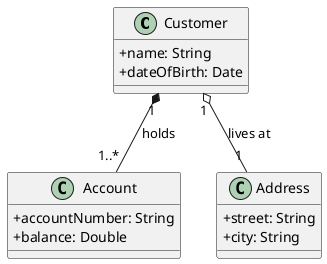
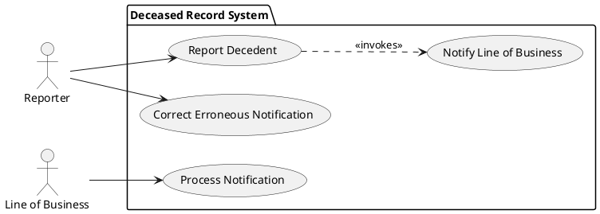
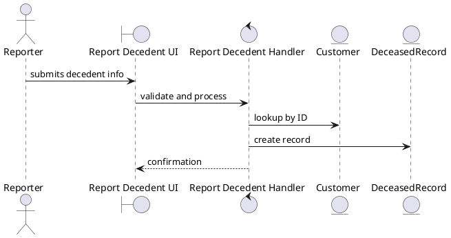
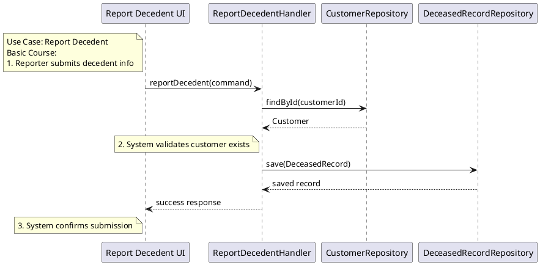
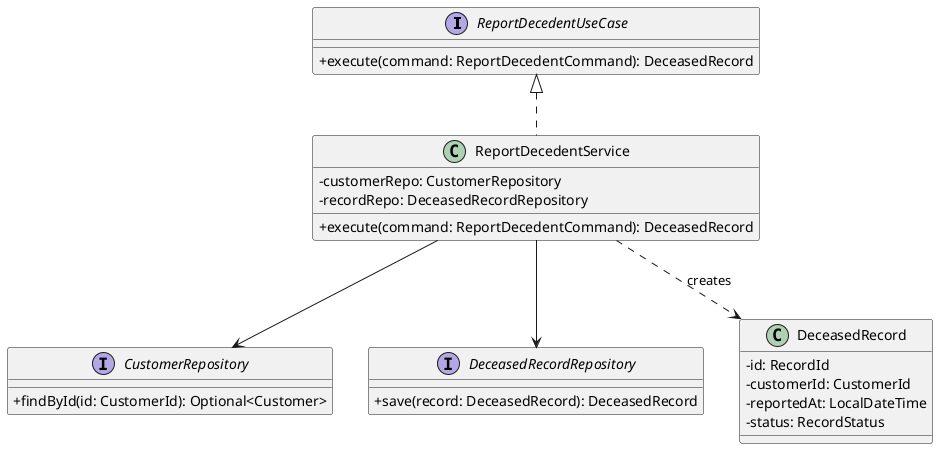

# PlantUML Patterns for ICONIX Process

> **Rule**: All diagrams produced during the ICONIX process **must** use PlantUML syntax, embedded in a fenced code block tagged `` ```plantuml ``.

---

## 1. Domain Model (Class Diagram)
*Used in Phase 1 — Domain Modeling and refined throughout Phases 2–3.*

Focus on real-world objects and their relationships (Aggregation, Generalization).



---

## 2. Use Case Diagram
*Used in Phase 1 — Use Case Modeling.*

Identify actors and their use cases; group into packages when needed.



---

## 3. Robustness Diagram (BCE)
*Used in Phase 2 — Robustness Analysis.*

Bridge the gap between requirements and design. Use Boundary, Controller, and Entity stereotypes.



---

## 4. Sequence Diagram
*Used in Phase 3 — Behavior Allocation.*

**Layout rule**: use case text as notes on the **left**, design decisions on the **right**.



---

## 5. Class Diagram (Detailed Design)
*Used in Phase 3 — Static Modeling.*

Full class diagram with visibility, types, and multiplicity.


