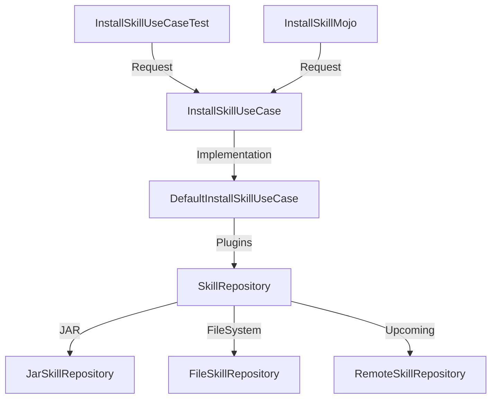

# Skills Maven Plugin

The **Skills Maven Plugin** is a lightweight, framework-agnostic tool designed to install bundled AI skills directly into your project. It enables developers to package reusable "skills" (templates, prompts, metadata) into a plugin and deploy them to standardized project locations with a single command.

## Key Features

- **📦 Bundled Skill Installation**: Automatically copies pre-defined skills from the plugin classpath to your repository.
- **🤖 Multi-Agent Support**: Installs skills into agent-specific directories (e.g., `.github/skills/`, `.agent/skills/`).
- **🛡️ Multi-Module Awareness**: Intelligently detects the project root to ensure skills are installed only in the top-level directory of multi-module projects.
- **🧩 Extensible Design**: Built using Clean Architecture principles, allowing for new skill sources (e.g., remote repositories) to be added easily.

## Design Architecture

The project follows the **Clean Architecture** pattern to decouple the Maven-specific interface from the core business logic.



- **Mojo (Interface Layer)**: Handles Maven configuration and command-line parameters.
- **UseCase (Domain Layer)**: Orchestrates the installation flow, validates the project root, and coordinates multiple skill repositories.
- **SkillRepository (Data/Infrastructure Layer)**: Abstraction for where skills are retrieved from, supporting both files and packaged JARs.

## Usage

To install skills into your project, run the following Maven command from your project root:

```bash
mvn skills:install -Dagent=github -Dskills=skill1,skill2
```

### Automated Installation (CI-aware)

To automatically install skills during local development while skipping the process in clean CI environments, we recommend wrapping the plugin in a Maven profile that activates when the `CI` environment variable is **not** set:

```xml
<profiles>
  <profile>
    <id>install-skills</id>
    <activation>
      <property>
        <name>!env.CI</name>
      </property>
    </activation>
    <build>
      <plugins>
        <plugin>
          <groupId>li.yansan.clean</groupId>
          <artifactId>skills-maven-plugin</artifactId>
          <version>${skills-maven-plugin.version}</version>
          <executions>
            <execution>
              <phase>initialize</phase>
              <goals>
                <goal>install</goal>
              </goals>
              <configuration>
                <agent>github</agent>
              </configuration>
            </execution>
          </executions>
        </plugin>
      </plugins>
    </build>
  </profile>
</profiles>
```

### Parameters

| Parameter | Property | Default | Description |
| :--- | :--- | :--- | :--- |
| `agent` | `agent` | `agent` | The name of the agent. Target directory will be `.{agent}/skills`. |
| `skills` | `skills` | (all) | A comma-separated list of skill names to install. |

## Project Structure

```text
clean-skills/
├── src/main/java/li/yansan/clean/skill/install/
│   ├── shell/plugin/        # Maven Mojos (Interface)
│   ├── usecase/             # Domain logic and abstractions
│   └── ...                  # Implementations
└── src/main/resources/skills/ # Bundled AI skill files
```

## Adding New Skills

To bundle a new skill with the plugin:
1. Create a new directory under `src/main/resources/skills/`.
2. Add your skill files (e.g., `SKILL.md`, prompts, etc.) to that directory.
3. Rebuild and install the plugin.