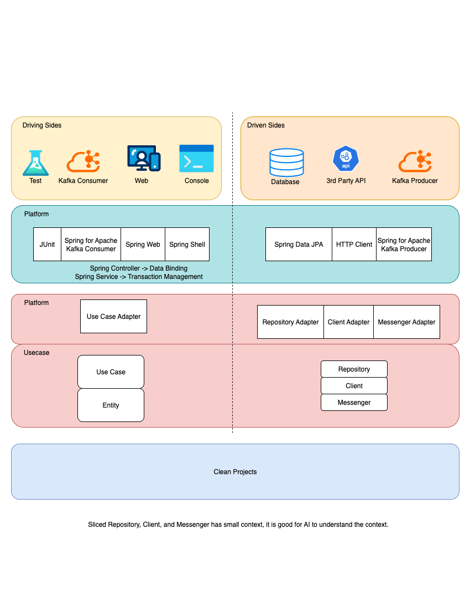

# Clean Architecture Principles - Updating

## Overview

Clean Architecture, as described by Uncle Bob (Robert C. Martin), ensures that the core business logic of a system is isolated from external concerns, making the system maintainable, flexible, and testable.

## Key Principles

### 1. Independent of Frameworks

* The architecture does not depend on any specific framework. Frameworks are treated as tools, not constraints.
* Example: Business logic can run without Spring Boot, JPA, or Kafka.

### 2. Testable

* Business rules can be tested in isolation without any external systems (UI, database, network, messaging).
* Use in-memory implementations for repositories, clients, or messengers to simulate external behavior.

### 3. Independent of UI

* The UI layer is decoupled from business rules.
* You can swap a web UI with a console UI, API, or mobile UI **without** modifying use cases.
* Inner layers do not know or depend on controllers, views, or endpoints.

### 4. Independent of Database

* Business logic does not depend on the type of database.
* You can switch from Oracle to MongoDB, BigTable, CouchDB, or others without changing use cases.
* Persistence is abstracted via interfaces (repositories, gateways).

### 5. Independent of External Agencies

* Business rules do not know about external systems such as payment gateways, messaging brokers, or third-party APIs.
* Interactions with the outside world are only through interfaces.
* Outer layers provide concrete implementations for these interfaces.

### 6. The Dependency Rule

* Source code dependencies always point inward.
* Nothing in an inner layer can know anything about something in an outer layer.
* Inner layers (entities, use cases) never depend on outer layers (UI, frameworks, databases, external services).

## Benefits

* The core logic (entities + use cases) is fully isolated from technical concerns.
* Frameworks, databases, UIs, and external services are replaceable tools.
* The system is highly maintainable, testable, and flexible.
* New developers can quickly understand the purpose of modules and the business domain.

## Summary

Clean Architecture ensures that business rules are central and protected from technology changes. The system is: framework-independent, testable, UI-independent, database-independent, and independent of external agencies, providing long-term maintainability and flexibility.


~~~
myapp/
├── pom.xml
│
├── myapp-core/
│    └── pom.xml
│
├── myapp-place-order/
│    ├── pom.xml
│    ├── platform/
│    │    └── order/
│    │         └── place/
│    │              ├── AbstractPlaceOrderUseCaseAdapter
│    │              ├── repository/
│    │              │    ├── AbstractOrderRepositoryAdapter.java
│    │              │    └── InMemoryOrderRepository.java
│    │              ├── client/
│    │              │    ├── AbstractPaymentClientAdapter.java
│    │              │    └── LocalPaymentClient.java
│    │              └── messaging/
│    │                   ├── AbstractOrderCreatedMessengerAdapter.java
│    │                   └── SystemOutOrderCreatedMessenger.java
│    └── usecase/
│         └── order/
│              └── place/
│                   ├── Order.java
│                   ├── ID.java
│                   ├── PlaceOrderUseCase.java
│                   ├── DefaultPlaceOrderUseCase.java
│                   ├── mapper/
│                   │    └── PlaceOrderMapper.java
│                   ├── repository/
│                   │    └── OrderRepository.java
│                   ├── client/
│                   │    └── PaymentClient.java
│                   └── messaging/
│                        └── OrderCreatedMessenger.java
│
├── myapp-cancle-order/
│    ├── pom.xml
│    ├── platform/
│    │    └── order/
│    │         └── place/
│    └── usecase/
│         └── order/
│              └── place/
│
├── myapp-spring-api/
│    ├── pom.xml
│    ├── config/
│    │    └── BeanConfig.java
│    └── platform/
│         ├── order/
│         │    ├── place/
│         │    │    ├── PlaceOrderController.java
│         │    │    ├── PlaceOrderService.java
│         │    │    ├── repository/
│         │    │    │    └── JpaOrderRepository.java
│         │    │    ├── client/
│         │    │    │    └── PaypalPaymentClient.java
│         │    │    └── messaging/
│         │    │         └── KafkaOrderCreatedMessenger.java
│         │    ├── cancel
│         │    └── search
│         └── customer
│
├── myapp-spring-console/
│    ├── pom.xml
│    └── platform/
│         ├── order/
│         │    ├── place/
│         │    │    ├── PlaceOrderService.java
│         │    │    ├── repository/
│         │    │    │    └── JpaOrderRepository.java
│         │    │    ├── client/
│         │    │    │    └── PaypalPaymentClient.java
│         │    │    └── messaging/
│         │    │         └── KafkaOrderCreatedMessenger.java
│         │    ├── cancel
│         │    └── search
│         └── customer
│
└── myapp-architecture-tests/
     ├── pom.xml
     └── ArchitectureTest.java
~~~

# Architecture Rationale: Clean Architecture Modular Design

## 1. Overview

This system implements **Clean Architecture** to achieve high modularity, maintainability, and platform independence.  
Each use case is isolated in its own module, allowing for focused development, independent deployment, and testability.

The top-level structure includes:

- **Core module** – central aggregator for all use cases.
- **Use case modules** – contain business logic, domain models, and abstract platform boundaries.
- **App modules** – concrete runtime implementations for different delivery mechanisms (e.g., web, console).

---

## 2. Architectural Objectives

1. **Enforce Dependency Direction**  
   All dependencies point inward. The domain and use case layers do not depend on any external frameworks or infrastructure.

2. **Isolate Business Logic**  
   The core logic remains free from technical details, ensuring testability and portability.

3. **Enable Platform Flexibility**  
   Abstract adapters define boundaries for external systems; concrete implementations are provided by platform-specific modules.

4. **Support Scalability**  
   Each use case lives in a standalone module that can evolve or be replaced independently.

---

## 3. Module Structure

### myapp-core
- **Purpose:** Acts as an aggregator for all use case modules.
- **Contents:** Only `pom.xml` defining module relationships and shared dependencies.
- **Rationale:** Keeps the core purely logical and enforces clean dependency flow.

### my-app-place-order
- **Purpose:** Defines the `Place Order` business use case.
- **Structure:**
    - `usecase/order/place/` — domain and use case logic, including:
        - `Order.java` – the aggregate root or command model.
        - `ID.java` – value object for identifiers.
        - `OrderRepository`, `PaymentClient`, `Messenger` – boundary interfaces.
    - `platform/order/place/` — abstract adapters bridging the use case layer with the outside world.
        - `AbstractOrderRepositoryAdapter` – implements `OrderRepository` and extends `AbstractRepositoryAdapter`.
        - `AbstractPaymentClientAdapter` – implements `PaymentClient` and extends `AbstractClientAdapter`.
        - `AbstractOrderCreatedMessengerAdapter` – implements `OrderCreatedMessenger`  and extends `AbstractMessengerAdapter`.

### myapp-app-web / myapp-app-console
- **Purpose:** Concrete runtime applications implementing the abstract adapters from the use case modules.
- **Structure:** Mirrors the `platform` package of the corresponding use case module.
- **Examples:**
    - `OrderRepositoryAdapter` extends `AbstractOrderRepositoryAdapter`.
    - `PaymentClientAdapter` extends `AbstractPaymentClientAdapter`.
    - `MessengerAdapter` extends `AbstractMessengerAdapter`.
- **Rationale:** Keeps implementation package-private and aligned with the abstract definitions.

---

## 4. Clean Architecture Alignment

| Layer | Purpose | Example | Dependency Direction |
|--------|----------|----------|----------------------|
| **Entities** | Domain model | `Order`, `ID` | None |
| **Use Cases** | Application logic | `PlaceOrderUseCase`, `OrderRepository` | → Entities |
| **Platform (Abstract Adapters)** | Boundary abstractions | `AbstractOrderRepositoryAdapter` | → Use Cases |
| **App (Concrete Adapters)** | Technical implementation | `OrderRepositoryAdapter` | → Platform |

This ensures:
- **Framework Independence** – Core logic is technology-agnostic.
- **Testability** – Use cases can be tested without external systems.
- **Replaceability** – Infrastructure changes require only adapter updates.

---

## 5. Design Benefits

| Goal | Achieved By |
|------|--------------|
| High Cohesion | Each module owns a single use case. |
| Loose Coupling | Interfaces and abstract adapters define strict boundaries. |
| Scalability | Adding new use cases or delivery mechanisms is isolated. |
| Testability | Core logic has no side effects from infrastructure. |
| Portability | Each app module can use different frameworks. |

---

## 6. Risks and Mitigations

| Risk | Description | Mitigation |
|------|--------------|-------------|
| Module proliferation | Too many small modules may increase build time. | Manage via parent POM and version alignment. |
| Adapter duplication | Similar adapters may appear in multiple apps. | Factor shared logic into reusable abstract classes. |
| Dependency reversal | A platform or app may depend incorrectly on a use case. | Enforce via ArchUnit validation tests. |

---

## 7. Conclusion

The design fully adheres to Clean Architecture principles:
- **Business logic is insulated** from frameworks and infrastructure.
- **Adapters provide clear integration boundaries.**
- **Apps implement runtime concerns** without polluting core logic.

This architecture supports long-term maintainability, scalable modular growth, and adaptability to future technologies.


# Developer Onboarding Guide

## 1. Purpose
This guide helps new developers understand how to extend or maintain the project while preserving its Clean Architecture design principles. The architecture promotes modularity, separation of concerns, and testability.

## 2. Project Layout Summary
- **myapp-core** — aggregates all use case modules and defines common dependencies.
- **myapp-app-web** — web application with HTTP-based delivery.
- **myapp-app-console** — command-line or batch application.
- **my-app-<usecase>** — self-contained module implementing a specific business use case.

Each use case module defines:
- **usecase/** — pure business logic and domain model.
- **platform/** — abstract adapters defining external system boundaries.

Each app module defines:
- **platform/** — concrete implementations of the abstract adapters from use cases.

## 3. How to Add a New Use Case
1. Create a new Maven module following the naming convention `my-app-<usecase>`.  
   Example: `my-app-cancel-order`.
2. Define the package structure as:
   ```
   usecase/<resource>/<action>/
   platform/<resource>/<action>/
   ```
3. In the `usecase` package:
    - Define the domain model (e.g., Order, Customer).
    - Create interfaces for Repository, Client, and Messenger.
    - Write a UseCase class encapsulating the application logic.
4. In the `platform` package:
    - Create abstract adapter classes implementing the use case interfaces.
    - Each abstract adapter should extend the relevant base adapter, such as `AbstractRepositoryAdapter`.
5. Register the module in the `myapp-core/pom.xml` `<modules>` section.

## 4. How to Implement a New Platform (Web, Console, etc.)
1. Inside the target app module (for example, `myapp-app-web`):
    - Mirror the same `platform/<resource>/<action>/` structure.
    - Provide concrete classes extending the abstract adapters.  
      Example:
   ```
   platform/order/place/repository/OrderRepositoryAdapter.java
   ```
   ```java
   public class OrderRepositoryAdapter extends AbstractOrderRepositoryAdapter {
       // Implementation details using JPA, JDBC, or another persistence API
   }
   ```
2. Keep classes package-private to maintain modular encapsulation.
3. Use dependency injection to connect these adapters to controllers, schedulers, or jobs.

## 5. Testing Guidelines
- **Unit Tests:** Test use cases in isolation using **local in-memory implementations** of interfaces instead of mocks.
    - Example:
        - Repository → stores data in a local `Map` or `List`.
        - Client → returns pre-defined local data responses.
        - Messenger → prints messages to console or logs them in a local buffer.
    - This approach keeps tests closer to real behavior while maintaining isolation.
- **Integration Tests:** Test adapter implementations with embedded infrastructure (e.g., in-memory database).
- **Architecture Tests:** Run ArchUnit rules in `myapp-architecture-tests` to verify correct dependency direction.

## 6. Best Practices
- Follow the inward dependency rule: business logic never depends on frameworks or adapters.
- Keep domain entities immutable when possible.
- Reuse abstract adapters for shared behaviors.
- Maintain consistent naming:
    * Interface: `OrderRepository`
    * Abstract adapter: `AbstractOrderRepositoryAdapter`
    * Concrete implementation: `OrderRepositoryAdapter`

## 7. Common Pitfalls
| Issue | Symptom | Resolution |
|--------|----------|-------------|
| Cross-layer dependency | Use case references framework classes | Move framework logic to platform layer |
| Circular module dependency | Two use cases depend on each other | Introduce shared abstractions in a separate domain module |
| Leaky abstraction | App module exposes internal use case details | Use package-private access and do not export use case classes |

## 8. Summary
The project’s structure enforces modular, testable, and maintainable development.  
Each use case represents a self-contained business capability.  
App modules act as runtime bindings, ensuring that the business logic remains independent from frameworks and infrastructure.  
Following this guide will ensure architectural consistency and sustainable growth of the system.

