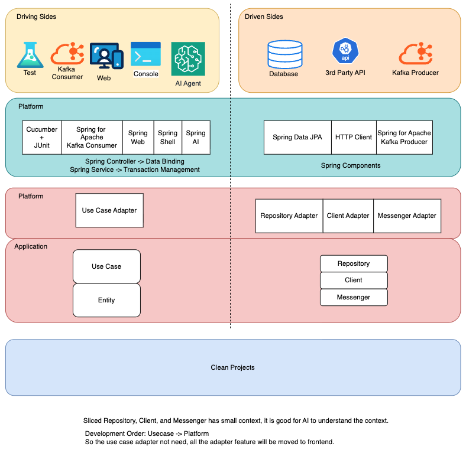

# Clean Project: From Architecture to Implementation

**Clean Project** is a reference implementation of Clean Architecture, designed to isolate core business value from technical volatility. It draws inspiration from Uncle Bob's (Robert C. Martin) structural principles and Ivar Jacobson's use case-driven philosophy.

> This document is a developer-facing guide to the Clean Project architecture. It explains the principles, structure, and workflow needed to understand and extend the system.

| Section | What You'll Learn |
|:---|:---|
| §1 Motivation | Why single-module Clean Architecture falls short |
| §2 Philosophy | The key principles and intellectual roots |
| §3 The Rule | The unidirectional dependency constraint |
| §4 Layers | What each concentric ring does |
| §5 Feature Folders | How the code is physically organized |
| §6 Playbook | Step-by-step guide for adding features |
| §7 Testing | How to test at each layer |

---

## 1. Why This Project Exists

Most Clean Architecture examples explain the concepts correctly but implement everything inside a **single project**. Business code and platform code live side by side in the same module.

**The Core Problem: Reusability** — When business logic and infrastructure are packaged together, the business layer cannot be reused independently. Extracting core logic into a console app, a different framework, or another organization's system requires untangling infrastructure concerns first. Every reuse effort drags framework dependencies along with it. Business rules should be portable—but single-module packaging defeats that.

**The Solution: Multi-Module Structure** — This project uses a Maven multi-module structure to make business logic **structurally reusable** and architectural violations **physically impossible**. Each Use Case is its own module, strictly separating `application` (pure business logic) from `platform` (adapter implementations). Delivery mechanisms live in separate runtime modules. Because modules are physically separated, the business layer can be published, shared, and reused independently—without dragging any framework along with it.

---

## 2. The Philosophy: Business First

The core goal of this project is to ensure that the system is **Independent of Frameworks, UI, and Databases**. By placing the business logic at the center, we ensure the following **Key Principles**:

1.  **Independent of Frameworks**: The architecture does not depend on the existence of some library of feature-laden software. This allows you to use such frameworks as tools, rather than having to cram your system into their limited constraints.
2.  **Testable**: The business rules can be tested without the UI, Database, Web Server, or any other external element.
3.  **Independent of UI**: The UI can change easily, without changing the rest of the system. A Web UI could be replaced with a console UI, for example, without changing the business rules.
4.  **Independent of Database**: You can swap out Oracle or SQL Server, for Mongo, BigTable, CouchDB, or something else. Your business rules are not bound to the database.
5.  **Independent of External Agency**: In fact your business rules simply don't know anything at all about the outside world.

### Jacobson's Influence: Use Cases as the Organizing Principle

Ivar Jacobson's *Object-Oriented Software Engineering* (1992) introduced the **Boundary-Control-Entity (BCE)** model and the idea that use cases should drive the entire architecture—not just requirements. Uncle Bob explicitly cites BCE as one of the foundations for Clean Architecture.

In this project, Jacobson's influence is most visible in:
- **Feature Folders** (Section 4): Each top-level module IS a use case, making the system's intent visible at a glance.
- **One Use Case, One Module**: Mirrors Jacobson's Use Case 2.0 principle of "building the system in slices," where each slice delivers distinct value.
- **BCE Mapping**: Entities → Entity, Use Cases → Control, Interface Adapters → Boundary.

---

## 3. The Rule: Unidirectional Dependency Constraint

The system is organized into concentric circles. The overriding rule is: **Source code dependencies can only point inwards.**

### Core Constraints
- **Mechanisms vs. Policies**: Outer circles (Mechanisms) represent *how* things are done (Web, DB); inner circles (Policies) represent *what* is being achieved.
- **No Compile-Time Dependency Inward to Outward**: Inner layers must not have any compile-time dependency on classes, variables, or types from outer layers.
- **Data Format Isolation**: No technical data formats (e.g., Spring or Hibernate objects) should ever leak into the inner circles.

### Implementation: Dependency Inversion via Ports & Adapters
This isolation is mechanically enforced using the **Dependency Inversion Principle (DIP)**. Inner layers define abstract interfaces (Ports) in the `application` package. The `platform` package provides base adapter implementations that bridge those ports to concrete technologies—following the Ports & Adapters (Hexagonal) pattern.

### Crossing Boundaries: Data Transfer

When data crosses a layer boundary, it must take the form most convenient for the **inner** circle—never the outer. Concretely:

- Use Cases accept and return **plain Java records** (Request/Response DTOs).
- JPA Entities, Spring objects, and HTTP-specific types must NEVER leak into the `application` package.
- Adapters are responsible for converting between external formats and application-level data structures.

### Transaction Boundary Ownership

Use Cases are business transactions, but they must **never** open or manage database transactions. Transactional demarcation belongs to the delivery mechanism (e.g., a Service class in the Spring module), which wraps the Use Case invocation. This ensures business logic remains portable and reusable outside any specific framework.

---

## 4. The Concentric Layers: Roles and Responsibilities

**These are the conceptual layers of the architecture, representing distinct roles and responsibilities.** While we package by feature physically (see Section 5), logically the code is separated into these rings.

### Use Cases
Following Jacobson's philosophy, Use Cases are the system's **reason for existing**. Each Use Case represents a single user goal and contains the **application-specific business rules** needed to achieve it. Use Cases orchestrate Entities and coordinate with external systems through Ports (interfaces) to fulfill that goal. They are isolated from externalities but respond to changes in operation logic.

**Responsibilities:**
1. Take input
2. Validate input
3. Validate business rules
4. Manipulate model state
5. Return output

### Entities

Uncle Bob defines Entities as encapsulating the **most general business rules**—the least likely to change. This project adopts a **Use Case–Scoped** approach: each feature module owns its own domain model.

An `Order` inside `myapp-place-order` is not a global domain abstraction—it is the domain model *as understood by that use case*. Different use cases may represent the same real-world concept differently, shaped by what that specific use case needs to accomplish. This eliminates coupling between features and keeps each module independently deployable and reusable.

### Interface Adapters
Adapters convert data between the formats convenient for use cases/entities and those required by **external agencies**. This layer contains MVC structures (Controllers, Presenters), persistence mapping, and is responsible for **handling database transactions**.

They act as the translators of the system, bridge-building between high-level business logic and low-level technical infrastructure. Depending on the direction of communication, adapters are categorized as either **Driving** or **Driven**.

#### Driving Adapters (Inbound)
Driving adapters wrap around the use cases and provide a way for the outside world to interact with the application. They translate external requests (like HTTP or CLI commands) into the application's input model.

**Web Adapter responsibilities:**
1. Map HTTP request to Java objects
2. Perform authorization checks
3. Map input to the input model of the use case
4. Call the use case adapter
5. Map output of the use case back to HTTP
6. Return HTTP response

**Use Case Adapter responsibilities:**
1. Take input
2. Start a transaction
3. Call the wrapped use case
4. Commit or rollback the transaction
5. Return output

#### Driven Adapters (Outbound)
Driven adapters are used by the application to talk to the outside world—whether to persist data, send messages, or call third-party services. They translate the application's output into the specific format required by the external technology.

**Persistence Adapter responsibilities:**
1. Take input
2. Map input into database format
3. Send input to the database
4. Map database output into application format
5. Validate output
6. Return output

**Messenger Adapter responsibilities:**
1. Take input
2. Map input into messenger format
3. Send input to the messenger
4. Map messenger output into application format
5. Validate output
6. Return output

**Client Adapter responsibilities:**
1. Take input
2. Map input into 3rd party API format
3. Send input to 3rd party API
4. Map 3rd party API output into application format
5. Validate output
6. Return output

### Frameworks and Drivers
The outermost layer of "Glue Code." This is where the actual Web Frameworks and Databases live. We keep them here so they do the least harm to the core logic.

---

## 5. The Physical Map: Feature Folders
We strictly follow the Package by Feature pattern.

### Why Feature Folders?

Uncle Bob's *Screaming Architecture* principle states that a project's structure should declare its **business purpose**, not its technology stack. When a developer opens the project, they should immediately see `place-order`, `cancel-order`, `search-customer`— not `controllers`, `services`, `repositories`.

Jacobson reinforces this: if Use Cases drive the architecture, the folder structure should reflect the use cases, not the technical layers.

Feature Folders also make the codebase **AI-friendly**: all context for a single business capability—entities, use cases, entities, and adapters—lives in one folder. You can feed a single folder to an LLM to understand a complete business capability without it needing to scan the whole repo.

The `application` / `platform` split also naturally **divides work by risk**. In the `application` layer, **humans lead and AI assists**—humans drive domain decisions, define business rules, and design use cases, while AI accelerates the implementation of pure, side-effect-free Java code. In the `platform` layer, **AI leads and humans review**—AI generates the repetitive adapter boilerplate, while humans verify the infrastructure boundary for security, performance, and correctness against real external systems.

The project structure is designed to "scream" its intent. We use **Feature Folders** (implementing the Package by Feature pattern). Top-level modules represent **Use Cases** (features), and the architectural layers (Application/Platform) are internal details of each feature.

### Structural Rules

1.  **Modules are Features**: Each Maven module is a distinct business capability (e.g., `myapp-place-order`, `myapp-cancel-order`).
2.  **Internal Layers**: Within each feature module, we strictly separate:
    -   `application`: Contains **Entities** and **Use Cases**. (Pure business logic).
    -   `platform`: Contains **Interface Adapters** and their **implementations** (Frameworks & Drivers).
3.  **Cross-Cutting Concerns**: Aggregator (`myapp-core`) and delivery mechanisms (`myapp-spring-api`) are kept separate.

### Project Layout

Naming follows the pattern: `[feature-module] -> [resource]/[action] -> application|platform`

~~~
myapp/
├── pom.xml
│
├── myapp-core/             # Aggregates all use cases
│    └── pom.xml
│
├── myapp-place-order/      # ← FEATURE MODULE (one per use case)
│    ├── pom.xml
│    └── order/
│        └── create/
│             ├── platform/                         # ← OUTER CIRCLE (adapters and fakes)
│             │     ├── repository/
│             │     │    ├── BaseOrderRepository.java
│             │     │    └── InMemoryOrderRepository.java
│             │     ├── client/
│             │     │    ├── BasePaymentClient.java
│             │     │    └── LocalPaymentClient.java
│             │     └── messaging/
│             │          ├── BaseOrderCreatedMessenger.java
│             │          └── SystemOutOrderCreatedMessenger.java
│             └── application/                      # ← INNER CIRCLE (pure Java, no frameworks)
│                   ├── Order.java
│                   ├── ID.java
│                   ├── PlaceOrderUseCase.java
│                   ├── PlaceOrderUseCaseImpl.java
│                   ├── repository/
│                   │    └── OrderRepository.java
│                   ├── client/
│                   │    └── PaymentClient.java
│                   └── messaging/
│                        └── OrderCreatedMessenger.java
│
├── myapp-cancel-order/
│    ├── pom.xml
│    └── order/
│         └── cancel/
│              ├── application/
│              └── platform/
│
├── myapp-spring-api/       # DELIVERY MECHANISM: Web/REST
│    ├── pom.xml
│    ├── config/
│    │    └── BeanConfig.java
│    ├── order/
│    │     ├── place/
│    │     │    └── platform/
│    │     │        ├── PlaceOrderController.java  # ← Web Adapter
│    │     │        ├── PlaceOrderService.java     # ← Use Case Adapter: implements Use Case using composite design pattern
│    │     │        ├── repository/
│    │     │        │    └── JpaOrderRepository.java    # ← Persistence Adapter
│    │     │        ├── client/
│    │     │        │    └── PaypalPaymentClient.java   # ← External System Adapter
│    │     │        └── messaging/
│    │     │             └── KafkaOrderCreatedMessenger.java  # ← Messaging Adapter
│    │     ├── cancel/
│    │     └── search/
│    └── customer/
│
├── myapp-spring-console/
│    ├── pom.xml
│    ├── order/
│    └── customer/
│
└── myapp-architecture-tests/
     ├── pom.xml
     └── ArchitectureTest.java
~~~

## 6. Developer Playbook: Extending the System

### Step 1: Add a New Use Case (Application)
1.  **Create the Module**: Create a new Maven module in the `myapp` directory with the naming pattern `myapp-[feature-name]`.
2.  **Define the Use Case**: Create a UseCase interface in the `application` package. This is the contract between the use case and the outside world.
3.  **Discover and Define the Domain**: Discover and create Entities/Value Objects in the `application` package. These are pure Java classes representing your business rules.
4.  **Discover and Define the Adapters**: Discover and create interfaces for what the use case needs (Repository, Client, Messenger) within the `application` package.
5.  **Implement the Use Case**: Write **exactly one** UseCase implementation class in the `application` package. Orchestrate your entities and use your adapters.
6.  **Test**: See Section 7 for the use case testing strategy.

### Step 2: Implement the Platform (Platform)
1.  **Bridge the Boundary**: Create abstract adapter classes in the `platform` package that implement your adapters (from Step 1).
2.  **Add to Aggregator**: Add the new use case module to the `myapp-core` aggregator.
3.  **Implement Runtime Adapters**: Inside your delivery mechanism module (e.g., `myapp-spring-api`), provide concrete classes extending the abstract adapters (e.g., a JPA repository or a REST client).
4.  **Wiring**: Wire these adapters using your framework (e.g., Spring Beans) ONLY in the delivery/platform layer.
5.  **Test**: See Section 7 for the platform testing strategy.

---

## 7. Testing Strategy

Testability is one of the five foundational principles of Clean Architecture. Each layer has its own testing approach:

| Test Type | Location | Dependencies | Purpose |
|:---|:---|:---|:---|
| **Unit Tests** | `application/` | None | Test Entities and Value Objects in isolation |
| **Use Case Tests** | `application/` | Test Fakes only | Drive interactors with in-memory adapters |
| **Platform Tests** | `platform/` | Real/mocked infra | Verify adapter behavior (e.g., DB queries) |
| **Architecture Tests** | `myapp-architecture-tests/` | ArchUnit | Enforce the Dependency Rule is never violated |

> **No mocking frameworks** (e.g., Mockito) in Use Case Tests. Use **Test Fakes** (`InMemory...`, `Local...`, `Console...`) instead—local in-memory implementations that drive the Use Case and verify logic rapidly.
